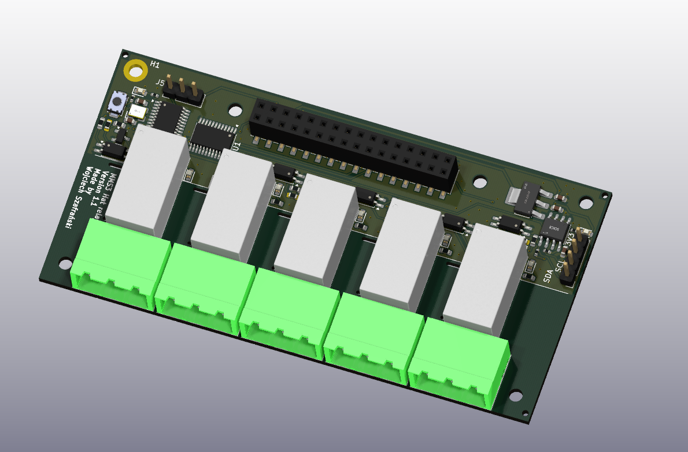

# MMS3 Hat Relay

## Sekcja 1: Dokumentacja Hat'a

### Krótki opis projektu
Hat realizuje funkcję 5-kanałowego sterownika przekaźników. Umożliwia przełączanie prądu o max parametrach 230V AC / 5A na kanał.

### Zgodność ze standardem ChainBus

* ✅ Używa złącza ChainBus, nie zmienia jego miejsca ani pinoutu.
* ✅ Używa wyłącznie interfejsu I2C do komunikacji zewnętrznej (działa w trybie Slave, nie inicjuje transmisji jako Master).
* ✅ Spełnia wymagania mechaniczne standardu (wymiary PCB, rozstaw otworów).
* ❌ Pobiera maksymalny prąd zgodny z ilością na jednego hat'a:  Jeden aktywny przekaźnik pobiera ok. 80 mA z linii 5V. Przy załączeniu wszystkich 5 kanałów jednocześnie hat pobiera **400 mA**, a max to 125mA.
* ✅ Obsługuje napięcie wejściowe BRD_VIN do wartości 48V.

### Komunikacja i adresowanie

#### Adresacja I2C
Komunikacja z modułem odbywa się za pomocą magistrali I2C.

| Układ (IC)   | Funkcja                                  |       Adres I2C (7-bit)        |
| :----------- | :--------------------------------------- | :----------------------------: |
| **CH32V003** | Mikrokontroler (programowalny ekspander) | *Definiowany w oprogramowaniu* |
| **M24C64-W** | Pamięć Identyfikajcji EEPROM             |             `0x50`             |

### Pinout mikrokontrolera CH32V003
Połączenia wewnętrzne sygnałów sterujących przekaźnikami oraz magistrali I2C:

| Pin MCU | Rola / Nazwa sygnału | Opis funkcjonalny                                      |
| :------ | :------------------- | :----------------------------------------------------- |
| **PC1** | I2C SDA              | Linia danych magistrali I2C (podłączona do ChainBus)   |
| **PC2** | I2C SCL              | Linia zegarowa magistrali I2C (podłączona do ChainBus) |
| **PC7** | K1                   | Sterowanie przekaźnikiem 1 (CN1)                       |
| **PC3** | K2                   | Sterowanie przekaźnikiem 2 (CN2)                       |
| **PC4** | K3                   | Sterowanie przekaźnikiem 3 (CN3)                       |
| **PC5** | K4                   | Sterowanie przekaźnikiem 4 (CN4)                       |
| **PC6** | K5                   | Sterowanie przekaźnikiem 5 (CN5)                       |

### Pinout złączy wykonawczych

Moduł wyposażony jest w 5 złączy oznaczonych jako CN1 do CN5 podłączonych do przekaźników.

| Złącze    | Opis pinu               | Funkcja                                                                                                                    |
| :-------- | :---------------------- | :------------------------------------------------------------------------------------------------------------------------- |
| **CN1-5** | Pin 1 Pin 2 Pin 3 | **NO** (Normally Open - normalnie otwarty) **COM** (Common - wspólny) **NC** (Normally Closed - normalnie zamknięty) |

### Szczegółowy opis techniczny
Hat z 5 kanałami przekaźników 5A 230VAC. Przekaźniki sa galwanicznie izolowane od MCU oraz każdy kanał ma diode LED do oznaczania swojej aktywacji.

Sygnały sterowane są z mikrokontrolera CH32V003 który robi za expander GPIO po I2C.

Każdy przekaźnik pobiera po ~80mA, więc właczenie wszystkich na raz przekracza limit prądu 1 hat'a

### Gotowe arkusze hierarchiczne
W projekcie wydzielono następujące moduły schematyczne:
* **CH32v003** – Arkusz zawierający strukturę mikrokontrolera, oscylator, przycisk reset, złącze programowania SWD (w standardzie WCH-Link).

* **Przekaźnik z optoizolacją** – Schemat pojedynczego kanału przekaźnika zawierający optoizolator, tranzystor 3V3 -> 5V, diodę zabezpieczającą, diodę LED sygnalizującą stan pracy oraz złącze wyjściowe.

---

## Sekcja 2: Specyfikacja standardu ChainBus

### Architektura i łączenie modułów
Standard ChainBus umożliwia modułowe łączenie hatów. Na jednym MMS3 można zamontować pionowo **do 8 hat'ów**. Połączenie realizowane jest poprzez wpięcie złącza męskiego kolejnego hat'a w złącze żeńskie poprzedniego.

### Komunikacja i sterowanie
Magistrala ChainBus jest w pełni cyfrowa. Płyta główna nie steruje bezpośrednio sygnałami ogólnego przeznaczenia (GPIO) na poszczególnych hat'ach. Wszelkie operacje (np. obsługa diod LED, odczyt krańcówek, sterowanie przekaźnikami) muszą być realizowane przez dedykowane układy scalone (np. ekspandery portów, mikrokontrolery pomocnicze) komunikujące się przez interfejsy systemowe.

Wybór aktywnego modułu realizowany jest przez układ przełącznika magistrali (bus switch) na płycie głównej. Dzięki temu linie I2C, SPI i UART są niezależne dla każdego hat'a (brak konfliktów adresów I2C między różnymi hatami).
* **Identyfikacja:** Każdy moduł powinien posiadać pamięć EEPROM na magistrali I2C w celu identyfikacji płyty przez system - układ M24C64-W skonfigurowany na adres `0x50` przy liniach adresowych A0, A1, A2 zwartych do masy.

### Zasilanie
Złącze ChainBus dostarcza następujące linie zasilania:

| Magistrala zasilania | Napięcie znamionowe | Maksymalny prąd (łączny dla 8 hatów) | Szacowany prąd na jeden hat |
| :------------------- | :-----------------: | :----------------------------------: | :-------------------------: |
| **5V**               |        5.0 V        |                1.0 A                 |           125 mA            |
| **12V stby**         |       12.0 V        |                0.5 A                 |            65 mA            |
| **BRD_VIN**          |   12.0 V – 48.0 V   |                1.5 A                 |           185 mA            |

*   Komponenty podłączone do linii `BRD_VIN` muszą być przystosowane do pracy z napięciem od 12V do **48 V**.

### Wymagania mechaniczne i złącza
* **Wymiary PCB:** Niedozwolona jest zmiana obrysu płytki oraz położenia otworów montażowych, aby zachować kompatybilność mechaniczną.
* **Pozycjonowanie złączy ChainBus:** Położenie złącza standardu 2x16 SMD (raster 2.54 mm) musi być zgodne z szablonem. Złącze żeńskie montowane jest na stronie FRONT, natomiast złącze męskie na stronie BACK.
* **Interfejsy zewnętrzne:** Złącza wejścia/wyjścia oraz ewentualne wysokonapięciowe wyjścia przekaźnikowe powinny być umieszczone przy dolnej krawędzi płytki, z zachowaniem odpowiednich odstępów izolacyjnych (clearance/creepage) wymaganych przy napięciu 230V.
* **Komponenty:** Wszystkie komponenty powinny znajdować się na stronie FRONT płytki, aby uniknąć kolizji mechanicznych z elementami sąsiadujących modułów w stosie.

---

## Sekcja 3: Licencje

### Licencje projektu

*   **PCB:** CERN-OHL-P
*   **Software:** MIT License

[Template](https://github.com/KoNaR-Hefajstos/MMS3_hat_templates/) jest na licencji CC0 1.0 Universal. **Reszta projektu nie jest na tej licencji**
